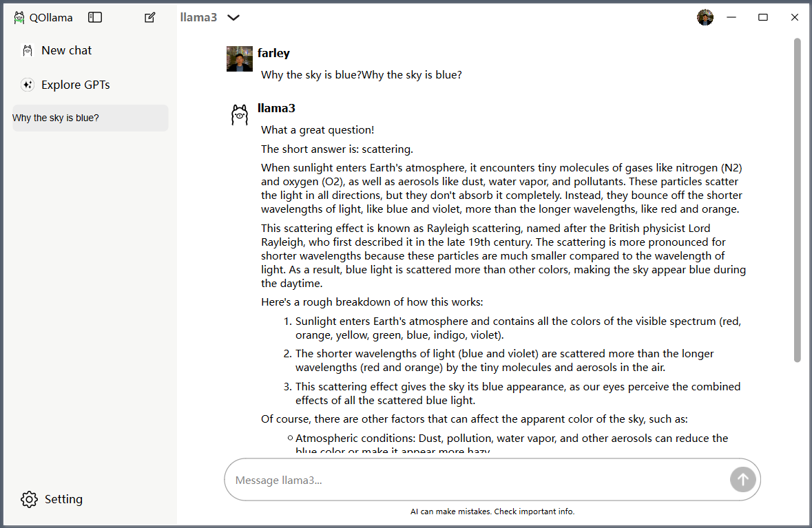

# QOllama


QOllama is a Qt-based client for [ollama](https://github.com/ollama/ollama). The application provides a user-friendly interface for interacting with the model and managing chat history.


## Features

- **Chat Interface**: Send and receive messages through a simple chat interface.
- **Multiple Chats**: Create and manage multiple chat sessions.
- **Chat History**: Save and view chat history.

## Screenshots



## Installation

### Prerequisites

- Qt 5 or higher
- C++11 or higher

### Steps

1. **Clone the Repository**:
    ```sh
    git clone https://github.com/farleyrunkel/qollama
    cd qollama
    ```

2. **Open the Project**:
    Open the project in Qt Creator or any compatible IDE.

3. **Build the Project**:
    Build the project using your IDE or run the following commands in the terminal:
    ```sh
    cmake
    make
    ```

4. **Run the Application**:
    Run the application through your IDE or execute the built binary:
    ```sh
    ./qollama
    ```

## Usage

1. **Start a New Chat**:
   - Click the "New Chat" button to create a new chat session.
   - Enter your message in the input line and press Enter or click the input button.

2. **Send a Message**:
   - Type your message in the input line.
   - Press Enter or click the input button to send the message.

3. **View Chat History**:
   - Click on a chat session in the history list to view the messages.

4. **Expand/Collapse Side Widget**:
   - Click the expand button to toggle the visibility of the side widget.

## Contribution

1. Fork the repository.
2. Create your feature branch (`git checkout -b feature/new-feature`).
3. Commit your changes (`git commit -am 'Add some feature'`).
4. Push to the branch (`git push origin feature/new-feature`).
5. Open a pull request.

## License

This project is licensed under the MIT License - see the [LICENSE](LICENSE.txt) file for details.

## Acknowledgements

- Thanks to the Qt community for their excellent framework and support.
- Special thanks to Ollama for providing the model used in this application.

---

Feel free to modify and expand this README to better fit your project's specifics. If you need any further customization or additional sections, let me know!
