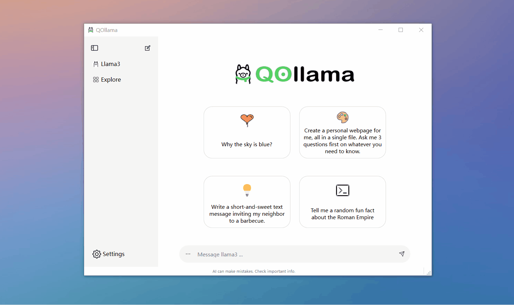
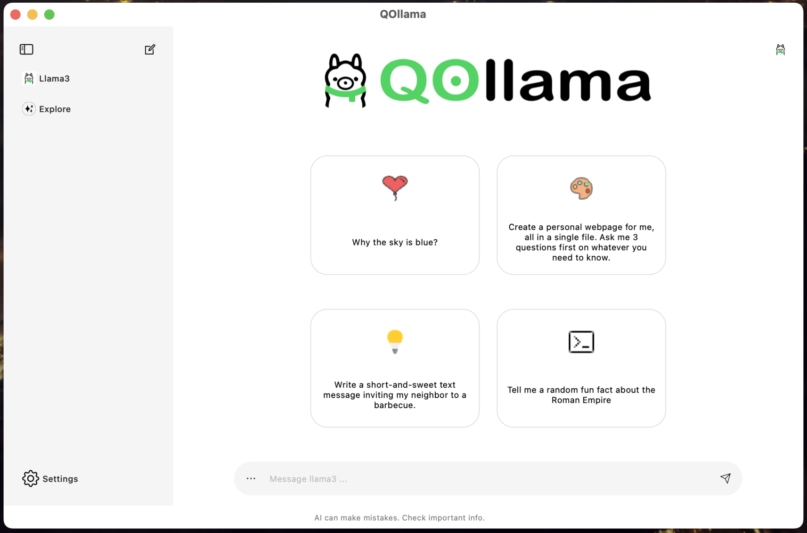
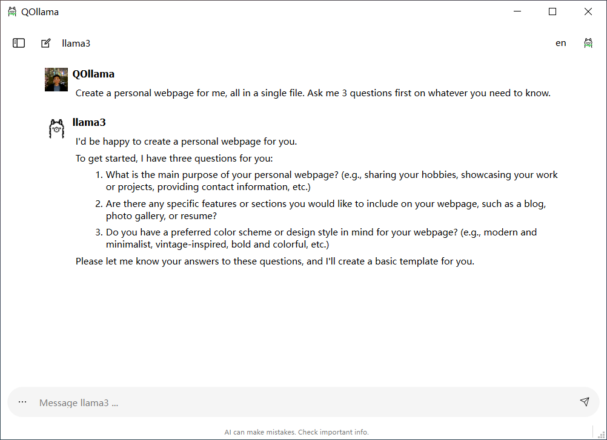
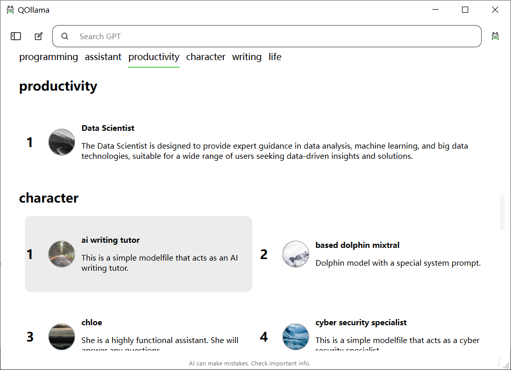
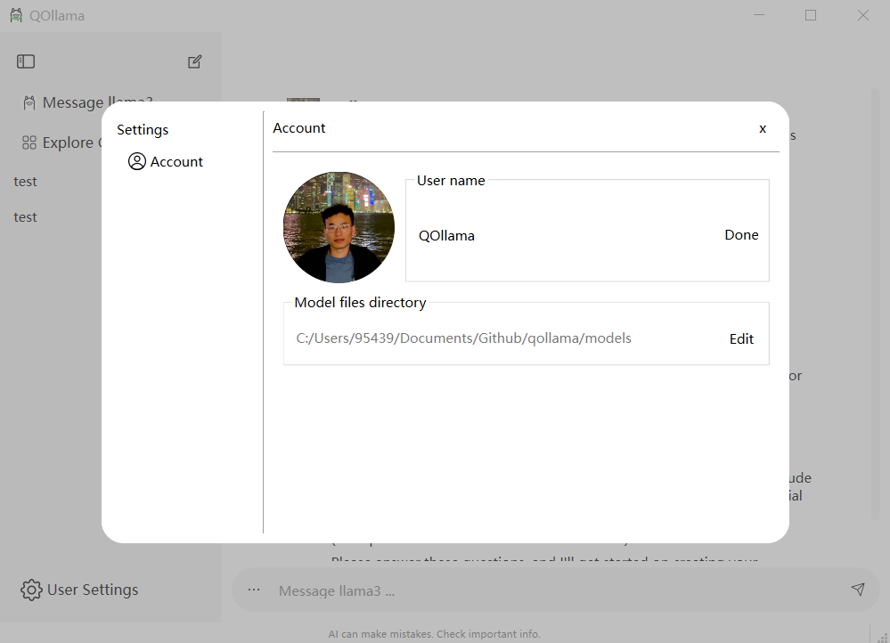

# QOllama


QOllama is a Qt-based client for [ollama](https://github.com/ollama/ollama). The application provides a user-friendly interface for interacting with the model and managing chat history.



## Features

- **Chat Interface**: Send and receive messages through a simple chat interface.
- **Multiple Chats**: Create and manage multiple chat sessions.
- **Chat History**: Save and view chat history.

## Screenshots

| Windows | MacOS |
| :---: | :---: |
|  |  |

| Chats page | market page | settings page |
| :---: | :---: | :---: |
|  |  |  | 

## Directory Structure

- **design**: Directory for design-related files.
- **external**: Contains external libraries and dependencies.
- **models**: Directory for custom models.
- **resources**: Contains application resources such as icons, images, and stylesheets.
  - **icon**: Icon files for the application.
  - **images**: Image files used in the application.
  - **psd**: PSD files for design purposes.
  - **qss**: Qt Style Sheets for customizing the application's appearance.
- **src**: Source code directory.
  - **3rdParty**: Third-party libraries and components.
  - **buttons**: Directory for button components.
  - **container**: Components related to containers and layouts.
  - **display**: Components for displaying data and information.
  - **include**: Header files and external includes.
  - **input**: Input-related components such as text fields and buttons.
  - **network**: Networking-related components and functionalities.
  - **objects**: QOject-related components
  - **pages**: Application pages and UI components.
  - **scripts**: Scripts for getting information from the server and processing
- **tests**: Test cases and testing-related code.

## Installation

### Prerequisites

- Qt 5 or higher
- C++11 or higher
- CMake
- Git
- Python 3 or higher
- ollama-server
  
### Steps

1. **Clone the Repository**:
    ```sh
    git clone https://github.com/farleyrunkel/qollama
    cd qollama
    ```

2. **Initialize Submodules**:
    ```sh
    git submodule update --init --recursive
    ```

3. **Open the Project**:
    Open the project in Qt Creator or any compatible IDE.

4. **Configure the Project**:
    Ensure that Qt and CMake are properly configured in your IDE. Alternatively, you can configure it manually in the terminal:
    ```sh
    mkdir build
    cd build
    cmake ..
    ```

5. **Build the Project**:
    Build the project using your IDE or run the following command in the terminal:
    ```sh
    make
    ```

6. **Run the Application**:
    Run the application through your IDE or execute the built binary:
    ```sh
    ./qollama
    ```

## Contribution

1. Fork the repository.
2. Create your feature branch (`git checkout -b feature/new-feature`).
3. Commit your changes (`git commit -am 'Add some feature'`).
4. Push to the branch (`git push origin feature/new-feature`).
5. Open a pull request.

## License

This project is licensed under the MIT License - see the [LICENSE](LICENSE.txt) file for details.

## Acknowledgements

- Thanks to the Qt community for their excellent framework and support.
- Special thanks to Ollama for providing the model used in this application.

---

Feel free to modify and expand this README to better fit your project's specifics. If you need any further customization or additional sections, let me know!
